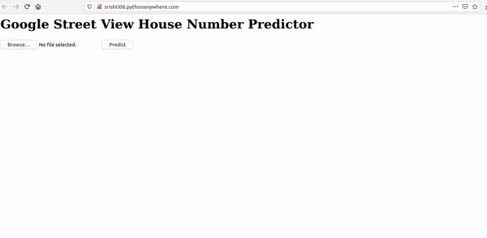
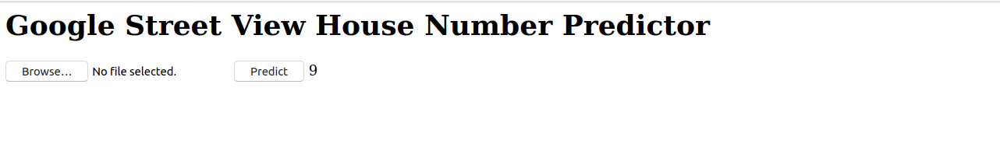
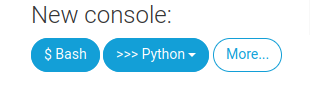
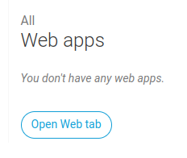
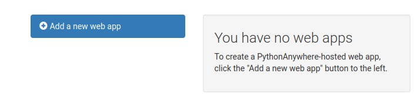

In this tutorial we take the image classification model built in `model.py` which recognises Google Street View House Numbers. Using Flask to create an API, we can deploy this model and create a simple web page to load and classify new images. 

**Deployed Code Live in Action on Web**

Webpage: http://srishti08.pythonanywhere.com/



## To Run Locally:

- Install pip and Python 3
- Clone this repository `git clone https://github.com/copperwiring/model-deployment-locally-and-with-flask.git`
- Navigate to the working directory `cd model-deployment-locally-and-with-flask`
- Install the Python dependencies `pip install -r requirements.txt`
- The project expects an additonal data ` extra_32x32.mat` (not present here due to the size) in the working directory. You can download the data from here: http://ufldl.stanford.edu/housenumbers/ 
- Get model pickel using `python model.py`.
- Run the API `python api.py`
- Open a web browser and go to `http://localhost:8000`



**Note:** Though it is recommended that you run `model.py` to generate your own pickled model, picked model used for testing can be found [here](https://drive.google.com/file/d/1HeKrKr7NqiYjz5zCTcgEfMO6-EZtAiut/view?usp=sharing). This was created using `scikit-learn==0.21.3` and can be tested with this. `scikit-learn` doesn't support pickling and unpickling across different version [[Source](https://github.com/scikit-learn/scikit-learn/issues/16570)].


## To Run on Web:

We will user https://www.pythonanywhere.com/ to host our webage which will show the results of the model prediction. Note, here we will not train the model on server. Rather, we will use the trained model (`model.pkl`) to deserialize on server to make prediction.

- Create an account with [pythonanywhere](https://www.pythonanywhere.com/).
- Go to Dashboard
- Click on `console` and a console window will open up.



- Install the dependencies from `requirements.txt`. Example: `pip install scikit-learn==0.21.3`. You can also do this in a virtual env.

```
# make virtual environment 
mkvirtualenv --python=/usr/bin/python3.7 my-virtualenv  

# install required dependencies. See requirement.txt
pip install scikit-learn==0.21.3
pip install Flask==2.0.1 

....
```
- Initiate web app. 



- Navigate to web tab and click on `Add new web app`. 



- You will be asked to select domain name (select default), framework name (select manual configuration) and python version(select version same as of virtual environment).

- Upload flask application files under `files` (in dashboard menu) i.e. upload flask application file (api.py), saved model file (model.pkl) and template directory with index.html inside specified project directory path. 

    **Note:** `pythonanywhere` restricts the file upload size to 100MiB for each file. If your file size is greater, you might want to consider other ways to upload e.g. zip [[Source](https://help.pythonanywhere.com/pages/UploadingAndDownloadingFiles)]

- Customizing web app for flask application:
    Open WSGI configuration file(under web > code),uncomment flask portion, set project directory path and update your flask app name. In my case, all files were in the current working directory. Below is the extract of WSGI configuration file for our flask application setup.:

    ```
    import sys

    # The "/home/Srishti08" below specifies your home
    # directory -- the rest should be the directory you uploaded your Flask
    # code to underneath the home directory.  So if you just ran
    # "git clone git@github.com/myusername/myproject.git"
    # ...or uploaded files to the directory "myproject", then you should
    # specify "/home/Srishti08/myproject"
    path = '/home/Srishti08/'
    if path not in sys.path:
        sys.path.append(path)

    from api import app as application
    ```
In above example project directory is set as `‘/home/Srishti08/’` and flask app name is `api`. Customize in accordance with your user name and app name.
- Go back to `Dashboard`, click `Web` tab and reload your website.
- Web app is hosted and running at `username.pythonanywhere.com`. It should look like this:


